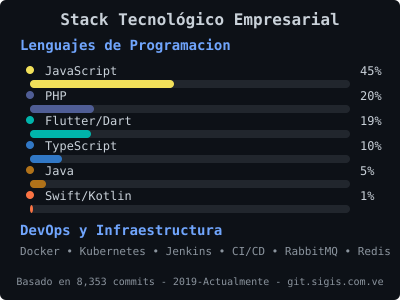

  # 👋 ¡Hola! Soy Luis González

  <h3>🚀 Full Stack Engineer | Mobile & Web Specialist | 7+ años transformando ideas en soluciones digitales</h3>

  

    
  

  

---

## 🎯 Sobre Mí

Ingeniero de Sistemas con **7+ años de experiencia** desarrollando soluciones full-stack innovadoras. Especializado en desarrollo móvil multiplataforma con **Flutter**, aplicaciones web escalables con **Angular** y backends robustos con **Node.js/Express** y **PHP**. Experiencia sólida en arquitecturas de microservicios, APIs RESTful, y sistemas de mensajería con RabbitMQ. Apasionado por la arquitectura limpia, principios SOLID y la creación de código mantenible y eficiente.

🌍 **Ubicación:** Venezuela
💼 **Actualmente:** Analista de Desarrollo Tecnológico Senior @ Soluciones Integrales GIS C.A
🎓 **Formación:** Ingeniero de Sistemas - UNEFA | Java SE8 Certified
🌐 **Idiomas:** Español (Nativo) | Inglés (Intermedio - En continuo aprendizaje)

---

## 🚀 Proyectos Destacados

<table>
  <tr>
    <td width="50%">
      <h3 align="center"> Aerotasa</h3>
      

        
        
      

      

        <strong>Desarrollado desde cero</strong> 
        Sistema de gestión de tasas aeroportuarias en Venezuela 
        <code>Flutter</code> <code>Clean Architecture</code> <code>SOLID</code>
      

    </td>
    <td width="50%">
      <h3 align="center"> TrazApp</h3>
      

        
        
      

      

        <strong>Desarrollado desde cero</strong> 
        Sistema de rastreo vehicular con plugins nativos personalizados 
        <code>Flutter</code> <code>Kotlin</code> <code>Swift</code> <code>GPS Tracking</code>
      

    </td>
  </tr>
  <tr>
    <td width="50%">
      <h3 align="center"> Pulsos</h3>
      

        
        
        
      

      

        <strong>Mantenimiento y nuevas features</strong> 
        Aplicación de salud y bienestar 
        <code>Sencha</code> <code>Cordova</code> <code>Flutter (Nueva versión)</code>
      

    </td>
    <td width="50%">
      <h3 align="center"> YanomApp</h3>
      

        
      

      

        <strong>Desarrollo y mantenimiento</strong> 
        Sistema de censo indígena y control de vacunación 
        <code>Angular</code> <code>TypeScript</code> <code>PostgreSQL</code>
      

    </td>
  </tr>
  <tr>
    <td width="50%">
      <h3 align="center"> Athenium</h3>
      

        
      

      

        <strong>En desarrollo</strong> 
        Exchange de criptomonedas con métricas únicas de trading 
        <code>Angular</code> <code>TypeScript</code> <code>Emitter</code>
      

    </td>
    <td width="50%">
      <h3 align="center"> GTRMax & GTRPlus</h3>
      

        
        
        
        
        
      

      

        <strong>Mantenimiento y migración de sistemas de mapas</strong> 
        Sistema empresarial de seguimiento vehicular 
        <code>Sencha</code> <code>Cordova</code> <code>Leaflet</code> <code>PHP</code>
      

    </td>
  </tr>
</table>

### 🏥 Otros Proyectos Relevantes

- **SEDEM** - Sistema bancario para compra/venta de oro - Banco Central de Venezuela (PHP, Java, Mule ESB)

---

## 💻 Tech Stack

### 📱 Mobile Development

### 🌐 Frontend Development

### ⚙️ Backend Development

### 🗄️ Databases & Message Brokers

### 🗺️ Maps & Reporting

### 🔧 DevOps & Tools

### 🛠️ IDEs & Tools

---

## 🏆 Logros Destacados

- 🚀 **Desarrollo desde cero** de 2 aplicaciones publicadas en App Store y Google Play (Aerotasa, TrazApp)
- 🔧 **Creación de plugins nativos** en Kotlin y Swift para tracking GPS avanzado
- 🗺️ **Migración exitosa** de sistemas de mapas de Mapbox a Leaflet optimizando costos
- 📊 **Implementación de arquitecturas escalables** usando Clean Architecture y SOLID
- 🎯 **Fork y mejora de json_forms_renderer** - Plugin Flutter extendido con validaciones robustas, campos de firma digital, captura de imagen/audio, grabación de voz, corrección del campo date, botón submit integrado y método `validateForm()` para obtener todos los datos del formulario
- 🔄 **Integración CI/CD** con Docker, Jenkins y Kubernetes para despliegues automatizados
- 📡 **Implementación de arquitecturas de microservicios** con RabbitMQ para mensajería asíncrona y Redis para caché
- 💻 **8,353 commits** en GitLab privado empresarial ([git.sigis.com.ve](http://git.sigis.com.ve))

---

## 📊 Mis Estadísticas de Desarrollo

### 🏢 Contribuciones en GitLab Empresarial (Privado)

  
  
  

 

  #### 📈 Stack Tecnológico y DevOps

  

   

  **Lenguajes de Programación (Basado en 8,353 commits):**

  
  
  
  
  
  

  **DevOps & Infraestructura:**

  
  
  
  

  <i>💼 Datos basados en 7 años de desarrollo empresarial en git.sigis.com.ve</i>

---

### 🌍 Contribuciones en GitHub

  
  

---

## 🎯 Especialidades

<table>
  <tr>
    <td align="center" width="25%">
      
       <strong>Mobile Development</strong>
       Flutter • Native Plugins
       Clean Architecture
    </td>
    <td align="center" width="25%">
      
       <strong>Backend Development</strong>
       Node.js • Express • PHP
       APIs RESTful • PostgreSQL
    </td>
    <td align="center" width="25%">
      
       <strong>Frontend Development</strong>
       Angular • TypeScript
       Responsive Design
    </td>
    <td align="center" width="25%">
      
       <strong>DevOps & Cloud</strong>
       Docker • Kubernetes
       CI/CD • Microservices
    </td>
  </tr>
</table>

---

## 🌱 Actualmente

- 🔭 Desarrollando nuevas features para aplicaciones empresariales de tracking y logística
- 📚 Perfeccionando mi inglés con Open English
- 🎯 Explorando las últimas novedades de Flutter y Riverpod
- 💡 Implementando arquitecturas limpias y principios SOLID en proyectos legacy
- 💡 Contribuyendo a la comunidad open source con mejoras a plugins de Flutter

---

## 💼 Experiencia Profesional

| Periodo | Empresa | Cargo | Destacados |
|---------|---------|-------|------------|
| **2019 - Presente** | Soluciones Integrales GIS C.A | Analista de Desarrollo Tecnológico Senior | • Desarrollo de apps móviles con Flutter • Implementación de CI/CD • Arquitectura de microservicios |
| **2024 - 2025** | Outlier | Coding Expert Tier 3 - AI Training | • Evaluación de código generado por IA • Resolución de problemas complejos • Review de Java, JS, TypeScript, SQL |
| **2024** | Freelance | Desarrollador Flutter | • Tracking GPS en background • Implementación con Riverpod e Isar • Optimización con Clean Architecture |
| **2018** | Banco Central de Venezuela | Pasante | • Desarrollo sistema SEDEM • Arquitectura orientada a servicios • Stack: PHP, Java, Mule ESB |

---

## 📫 ¿Hablemos?

  ¿Tienes un proyecto interesante o buscas un desarrollador Full Stack comprometido?

  

---

  <i>💡 "El código limpio siempre parece que fue escrito por alguien a quien le importa" - Robert C. Martin</i>

